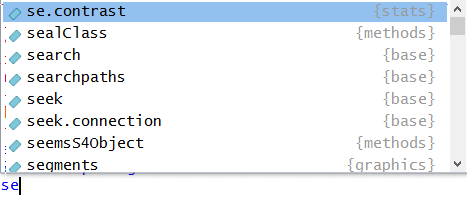
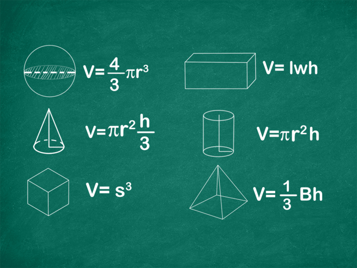
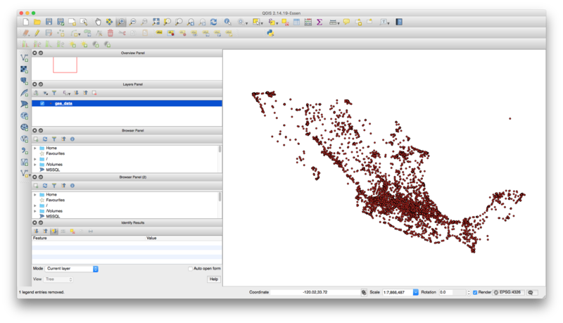

```{r setup, include=FALSE}
knitr::opts_chunk$set(echo = TRUE)
setwd('~/Documents/r/r-introduction/')
```

## Conceptos preliminares:

### R como una calculadora

En la clase pasada omitimos algunos elementos básicos de R para lograr que pudiésemos comenzar a graficar lo más pronto posible.

Uno de esos elementos es que R puede llevar a cabo operaciones como una calculadora. La consola de R entiende expresiones matemáticas y las puede operar para obtener sus resultados.

```{r}
2+2

2000*99^2-444
```

Estas operaciones no se guardan en el espacio de trabajo. Al igual que cuando se usa una calculadora sin guardar un resultado en su memoria, al momento de producir el resultado se pierde la operación.

### Asignación de objetos en R

Para almacenar un resultado en el espacio de trabajo de R es necesario asignarlo a un objeto. Las asignaciones en R tienen siempre la misma forma:

<center>**nombre_del_objeto <- valor**</center>


Por ejemplo puedes asignar una de las operaciones anteriores a un objeto en R.

```{r}
operacion_1 <- 2+2

```

Escribir el nombre del objeto en la consola es equivalente a pregunarle a R ¿Qué hay en ese objeto?

```{r}
operacion_1

```

Es buena práctica ponerle nombres informativos a los objetos que estamos generando. Recomendamos usar la nomenclatura llamada **snake_case** que se refiere a separar las palabras del nombre de tu objeto con un "_".

Construyamos otro objeto que guarda el resultado de una operación.

```{r}
esta_operacion_es_sumamente_larga <- 2+2^21*2183176321/(22+2.56^121)+11111

```

RStudio tiene una herramienta de autocompletado de nombres, si escribes en la consola únicamente "esta" y aprietas la tecla Tab debe completar el nombre del objeto anterior.

### Tipo de datos

Los vectores atómicos pueden ser de 6 distintos tipos: *logical*, *integer*, *double*, *character*, *complex*, y *raw*. 

```{r}

vector_logico <- c(TRUE, FALSE, FALSE, TRUE)
vector_logico
typeof(vector_logico)

vector_entero <- 1:4
vector_entero
typeof(vector_entero)

vector_double <- c(1.2, pi, sqrt(3)) 
vector_double
typeof(vector_double)

vector_char <- letters[1:4]
vector_char
typeof(vector_char)

vector_complex <- c(1 + 1i, 5i, 5)
vector_complex
typeof(vector_complex)

vector_raw <- c(charToRaw("the quick brown fox jumps over the lazy dog"))
vector_raw
typeof(vector_raw)

```


Podemos pedirle a R que **coercione** los datos para transformar su tipo:

```{r}
as.numeric("7.1")
as.logical(7)
as.logical(0)
```


### Funciones en R

Los comandos que se utilizaron la clase pasada para graficar se llaman funciones. Las funciones en R tienen la forma:

<center>**nombre_de_la_función(argumento1=valor1,argumento2=valor2,...)**</center>

El nombre de la función indica a R qué función se debe ejecutar. Cada función tiene asociada una lista de argumentos que le permiten saber a R qué le estás pidiendo que haga.

Como un primer ejemplo, la instalación de paquetes en R se puede llevar a cabo usando una función: install.packages(). Lo mínimo que necesita R para poder instalar un paquete es cuál debe instalar. Por esto el uso de esta función es simplemente install.packages(pkgs="nombre_del_paquete").

También debemos recordar que el símbolo "?" junto a una función nos permite acceder a la ayuda de R sobre la misma. 

Estudiemos ahora la función seq(), pueden escribir ?seq para ver la ayuda sobre esta función. Esta genera secuencias de números, por ejemplo para generar la secuencia de números enteros del 1 al 100 basta con escribir:

```{r}
seq(from=1,to=100)
```

Una observación útil es que el autocompletado de RStudio ¡sirve también para funciones! Intenta escribir "se" en la consola y luego oprimir la tecla Tab. Deberá aparecer un recuadro con un listado de opciones. 

```{r, echo=FALSE}

```

Escribir una letra más (e.g. "q") reduce la lista de opciones y la función seq deberá ya ser visible en ellas. Luego basta con oprimir la tecla Enter para elegir la función seq.

El resultado de utilizar una función se puede también asignar a un objeto. Esto será de gran utilidad a la hora de trabajar en R.

```{r}
secuencia_del_1_al_100 <- seq(from=1,to=100)

```

En la sección superior derecha de nuestro ambiente de RStudio ya deben existir dos objetos cargados en el espacio de trabajo: "esta_operacion_es_sumamente_larga" y "secuencia_del_1_al_100". Estos ya están cargados en la memoria RAM de la computadora y R puede acceder a ellos cuando se les solicite utilizando su nombre.

### Operadores booleanos

Sirven para comparar dos expresiones como las anteriores:

El operador __y__ (&) regresa verdadero si las dos expresiones que recibe son
verdaderas y falso en otro caso.

```{r}
(5 > 6) & (7 < 8) # Y: notar que regresa false porque 5 > 6 es falso
(5 < 6) & (7 < 8)
(5 > 6) & (7 > 8)
```

El operador __o__ (|) regresa verdadero si __alguna__ de las expresiones que
recibe es verdadera y falso en otro caso.

```{r}
(5 > 6) | (7 < 8) # O: notar que regresa true conque alguna de las expresiones sea verdadera
(5 < 6) | (7 < 8)
(5 > 6) | (7 > 8)
```

El operador lógico __no__ (! regresa verdadero si la expresión que recibe es
falsa y viceversa)

```{r}
5 > 6
!(5 > 6)
```

 Evalúa una a una las siguientes expresiones y
explica por qué da TRUE o FALSE. Sugerencia: compréndelas una a una y en orden.

```{r, eval=FALSE}
5 < 7
!(5 < 7)
5 > 6
6 <= 6
6 >= 6
!(5 < 7) & (5 > 6)
(!(5 < 7) & (5 > 6)) | (6 <= 6)
!(5 < 7) & ((5 > 6) | (6 <= 6))
```

## El paquete dplyr (instalado con el tidyverse)

```{r, message==FALSE}
# Cargando el paquete
library("tidyverse")
```

Un data frame se compone de __registros__ (renglones) y __campos o variables__ (columnas):


Con **dplyr** se podrán realizar acciones muy útiles como las siguientes:

1. **Seleccionar** campos de un data frame
2. **Filtrar** registros de un data frame que cumplan cierta condición.
3. **Ordenar** registros de acurdo a su valor en ciertos campos.
4. **Crear** nuevas columnas a partir de los valores de las preexistentes
5. **Calcular resúmenes** de **agregados** de datos (como las tablas dinámicas en
Excel).
6. **Unir tablas** de acuerdo a sus valores en ciertos campos (se verá más adelante).

### 1. Seleccionar campos de un data frame: select(df, columnas_a_seleccionar)

```{r}
# Usaremos el data frame diamonds cargado con "tidyverse"
glimpse(diamonds)
# View(diamonds) # Para ver el data frame en formato de Excel.

diamonds_columnas_selectas <- select(diamonds, carat, cut)
diamonds_columnas_selectas

# Otras maneras de seleccionar columnas:
select(diamonds, starts_with("c"))
select(diamonds, contains("able"))
select(diamonds, -carat, -cut, -color)
```

 Crea un data frame nuevo a partir de diamonds con
las columnas carat, x, y, z únicamente.

### 2. Filtrar registros de un data frame que cumplen cierta condición: filter(df, condiciones)

```{r}
diamonds_registros_selectos <- filter(diamonds, cut == "Ideal", x > 4)
diamonds_registros_selectos

# Otras maneras de filtrar registros
filter(diamonds, cut == "Ideal" & x > 4)
filter(diamonds, cut == "Ideal" | x > 4)

```

 Crea un data frame nuevo a partir de diamonds
que contenga los registros que cumplen la condición: '__alguna__ de x, y, z  es mayor a 3.5'

## El operador pipeline %>%

El ejercicio 3 de la tarea nos introduce a lo tedioso que es aplicar varias
funciones para transformar datos una tras otra sin ayuda. Aquí es cuando el operador
pipeline entra en acción:

Nos permite encadenar operaciones de manera sencilla, comenzando por el data frame
original (diamonds), luego aplicar una transformación, al resultado aplicar otra
y así sucesivamente.

Retomemos el ejemplo de la tarea 3. En lugar de:
```{r}
diamonds_dollars_per_carat <- mutate(diamonds, dollars_per_carat = price / carat)
diamonds_dollars_per_carat

diamonds_dollars_per_carat_filtrado <- filter(diamonds_dollars_per_carat, dollars_per_carat < 4000)
diamonds_dollars_per_carat_filtrado

diamonds_dollars_per_carat_filtrado_ordenado <- arrange(diamonds_dollars_per_carat_filtrado, desc(dollars_per_carat))
diamonds_dollars_per_carat_filtrado_ordenado
```

### 1. Joins: inner_join(df1, df2, columnas_a_seleccionar)

Es común encontrarse tablas que hacer referencia la una a la otra, por ejemplo:

```{r, echo=FALSE, }
tipos_caracter <- data_frame(
  id = c(1, 2, 3),
  tipo = c("letra", "número", "caracter especial")
)
caracteres <- data_frame(
  id = 1:10,
  caracter = c("a", "2", "3", "1", "z", "5", "m", "7", "s", "x"),
  tipo_caracter_id = c(1, 2, 2, 2, 1, 2, 1, 2, 1, 1)
)
```

Para asociar a cada caracter su tipo, podemos utilizar una funcionalidad llamada
__join__, que básicamente asocia registros de dos tablas usando campos en común.

```{r}
# Definiendo las tablas anteriores (normalmente estas tablas se leerán de archivos
# CSV o bases de datos como se verá en esta clase).

tipos_caracter <- data_frame(
  id = c(1, 2, 3),
  tipo = c("letra", "número", "caracter especial")
)

tipos_caracter

caracteres <- data_frame(
  id = c(1, 2, 2, 2, 1, 2, 1, 2, 1, 1),
  caracter = c("a", "2", "3", "1", "z", "5", "m", "7", "s", "x")
  
)
caracteres

# Haciendo el join de las tablas anteriores
inner_join(caracteres, tipos_caracter, by ="id")

# Notemos que el orden importa para renombrar y ordenarlas columnas
inner_join(tipos_caracter, caracteres, by ="id")

# Existen muchos tipos de joins, y también joins por más de un campo. Para ver
# estas opciones consultar la ayuda de R: ?inner_join.
```

## Funciones en R

Las funciones permiten la automatización de tareas. La escritura de funciones tiene tres grandes ventajas:

* Puedes nombrar una función de una manera tal que nunca olvides qué hace, esto además hace a tu código más legible
* Cuando cambien los requerimientos de los trabajos día a día, deberás de modificar menos código.
* Se reduce la probabilidad de cometer errores llevando a cabo procesos manuales como copiar/pegar datos e instrucciones.

Aprender a escrbir buenas funciones es un proceso que nunca termina. Siempre se encontrarán maneras novedosas de mejorar estilos a la hora de escribir funciones. Esta sección no tiene como objetivo profundizar en la escritura de funciones, si no empezar a escribir funciones útiles lo más pronto posible. 

### ¿Cuándo es conveniente escribir funciones?

Como regla general, si notamos que para llevar a cabo una cierta tarea se está copiando y pegando un bloque de código más de dos veces, es hora de escribir una función para ello. Motivaremos la discusión con el cálculo de areas y volúmenes. Si escribimos una función en R que permita llevar a cabo estas operaciones, las podremos usar en cualquier momento.




### Escribiendo funciones en R

Pasos para crear una función:

* Elegir un nombre apropiado
* Pensar en qué hace y cuántos argumentos necesita para ejecutarse
* Traducir lo que queremos que haga a código de R dentro de un bloque asociado a una función y a los argumentos anteriores

Pensando en estos pasos decidamos que nuestra función se llame area_circulo() (sin acento, es en general, mala práctica utilizar caractéres especiales en código). Luego sabemos que la función recibe un único parámetro, el radio del círculo al que se le va a calcular el área. Finalmente se debe plasmar la fórmula para el cálculo del área de un círculo en R.

Como un primer ejemplo escribamos una función que permita calcular el área de un círculo.

```{r}

# nombre ------------- argumentos
area_circulo <- function (radio) {
  area_calculada <- pi * radio ** 2 # operamos sobre el radio del círculo
  return(area_calculada) # regresamos el resultado (se asigna después de aplicar esta función)
}
```

Para probar la función la llamamos como cualquier función de una libreria, notemos que es posible asignar el resultado a una variable:

```{r}
area_radio_cinco <- area_circulo(5)
area_radio_cinco
```


 Ejercicio 1: Escribir una función análoga a la anterior pero para calcular el área de un rectángulo.

### Expresiones condicionales

En ocasiones es deseable ejecutar bloques de código únicamente cuando cierta condición se cumple. Existe una sentencia que nos permite hacer esto y tiene la forma siguiente:

```{r eval=FALSE}
if (cond) {
  # código ejecutado en caso de que la condición sea verdadera (TRUE).
} else {
  # código ejecutado en caso de que la condición sea falsa (FALSE).
}
```
Es posible omitir la segunda condición:

```{r eval=FALSE}
if (cond) {
  # si la condición es verdadera se ejecutará este bloque, en caso contrario no hará nada.
}
```

También es posible encadenar sentencias condicionales:

```{r eval=FALSE}
if (cond_1) {
  # código ejecutado en caso de que la condición 1 sea verdadera.
} else if (cond_2) {
  # código ejecutado en caso de que la condición 1 sea falsa pero la condición 2 es verdadera.
} else {
  # cuando ambas condiciones son falsas se ejecuta este bloque.
}
```

Regresando a nuestra función *area_circulo*, notemos que nuestra formulación tiene un problema. ¿Qué pasa cuando la función recibe números negativos? ¿Tiene sentido hablar de areas negativas? Usaremos las sentencias condicionales para arreglar este detalle:

```{r}

# nombre ------------- argumentos
area_circulo <- function (radio) {
  if (radio < 0) # expresión condicional se ejecuta en caso de que el radio sea negativo.
  {
    print("Para calcular un area es necesario un valor positivo o igual a 0.") # detiene la ejecución
  } else # sigue la expresión condicional, este bloque se ejecutará cuando el radio sea positivo.
  {
    area_calculada <- pi * radio^2 # operamos sobre el radio del círculo
    return(area_calculada) # regresamos el resultado (se asigna después de aplicar esta función)
  }
  
}
```

Probemos nuestra función mejorada con ambos tipos de valores. ¿Qué pasa cuando la usamos con un número negativo?

```{r eval=FALSE}
# probemos nuestra función en
area_resultante <- area_circulo(-10)
```


```{r}
# probemos nuestra función en
area_resultante <- area_circulo(7)
```

## Open Data

Existen muchas opciones para obtener datos abiertos. Para el presente ejercicio usaremos dos tablas extraidas de [datos.gob.mx](https://datos.gob.mx/busca/dataset/estaciones-de-servicio-gasolineras-y-precios-comerciales-de-gasolina-y-diesel-de-cre) sobre el precio de la gasolina en los establecimientos registrados a lo largo y ancho del país.

Notemos que la información viene estructurada en dos archivos distintos **places.xml** y **prices.xml**. Además la información está en un formato llamado xml. A continuación se muestra algunas lineas de estos archivos. Primero los datos de lugares:

```
<?xml version="1.0" encoding="utf-8"?>
<places>
  <place place_id="2039">
    <name>ESTACION DE SERVICIO CALAFIA, S.A. DE C.V.</name>
    <brand>PEMEX</brand>
    <cre_id>PL/658/EXP/ES/2015</cre_id>
    <category>GAS_STATION</category>
    <location>
      <address_street>Boulevard Insurgentes No. 1910</address_street>
      <x>-116.9214</x>
      <y>32.47641</y>
    </location>
  </place>
  <place place_id="2040">
    <name>DIGEPE, S.A. DE C.V. (07356)</name>
    <brand>PEMEX</brand>
    <cre_id>PL/902/EXP/ES/2015</cre_id>
    <category>GAS_STATION</category>
    <location>
      <address_street>Carretera Ixmiquilpan - Palmillas Km 58.5 Huichapan</address_street>
      <x>-99.74484</x>
      <y>20.3037</y>
    </location>
  </place>
```

Y ahora los datos de los precios en cada lugar:

```
<?xml version="1.0" encoding="utf-8"?>
<places>
  <place place_id="11703">
    <gas_price type="regular" update_time="2018-05-10 00:00:00">18.36</gas_price>
    <gas_price type="premium" update_time="2018-05-10 00:00:00">19.75</gas_price>
  </place>
  <place place_id="11702">
    <gas_price type="regular" update_time="2018-05-10 01:00:00">18.47</gas_price>
    <gas_price type="premium" update_time="2018-05-10 01:00:00">20.02</gas_price>
    <gas_price type="diesel" update_time="2018-05-10 01:00:00">19.47</gas_price>
  </place>
  <place place_id="11701">
    <gas_price type="regular" update_time="2018-05-11 00:01:00">13.69</gas_price>
    <gas_price type="diesel" update_time="2018-05-11 00:01:00">18.74</gas_price>
  </place>
```
Notemos que la información de ambos archivos está ligada de cierta forma por medio del atributo **place_id**. Eso significa que en teoría podremos juntar la información por medio de un **join** como ya se vio. Se trabajará en el proceso de extracción de los datos para obtener data frames a partir de esta información. Para esto usaremos un paquete llamadao **xml2**.

```{r}
library('tidyverse')
library('xml2')
places <- read_xml("./data/places.xml")
```

Primero trabajaremos con los datos de los lugares. Este archivo contiene la información que permitirá georeferenciar los datos. El formato **xml** opera con una estructura de arbol donde cada nodo tiene una jerarquía y puede tener nodos hijos. Afortunadamente el paquete **xml2** nos ayuda a acceder la información sin demasiada dificultad. Extraeremos 5 variables de interés incluyendo la latitud y la longitud de cada establecimiento. Además el **id** que servirá para hacer la liga con los datos del otro archivo, finalmente, **name** y **brand** nos darán información que puede ser útil para el análisis. 

```{r}
id <- places %>% xml_find_all("//place") %>% map(xml_attr, "place_id") %>% as.numeric()
name <- places %>% xml_find_all("//place/name") %>% xml_text
brand <- places %>% xml_find_all("//place/brand") %>% xml_text
longitude <- places %>% xml_find_all("//place/location/x") %>% xml_text %>% as.numeric()
latitude <- places %>% xml_find_all("//place/location/y") %>% xml_text %>% as.numeric()

```

Con la información extraida generamos un **tibble**:

```{r}
places_df <- tibble(id=id, name=name, brand=brand, lat=latitude, lon=longitude)
```

Ahora hacemos algo análogo con el archivo de precios. Lo primero que es importante notar es que la estructura de este archivo no es fija sino que cada lugar puede tener un número varible de precios dependiendo de los tipos de gasolinas disponibles. Esto dificulta la lectura ya que no podemos saber *a priori* la cantidad de datos que leeremos por cada lugar. Para solventar esto crearemos una función auxiliar y la aplicaremos a cada uno de los lugares leidos por medio de la función **map** (que lee una lista y aplica la función que le digamos a cada elemento de la lista).

La lectura de id funciona igual que en el archivo anterior:

```{r}
prices <- read_xml("./data/prices.xml")

id <- prices %>% xml_find_all("//place") %>% map(xml_attr, "place_id") %>% as.numeric()
```

Para la lectura de los precios, creamos una función que leerá cada estrucura **place** y rellenará un vector con la información deseada. 
```{r}
clean <- function(x){ 
  nodes <- xml_find_all(x, ".//gas_price")
  row <- c(regular = NA, premium = NA, diesel = NA)
  if(length(nodes) > 0) {
    for(n in 1:length(nodes)) {
      if(xml_attr(nodes[n], "type") == "regular") {
        row["regular"] = as.numeric(xml_text(nodes[n]))
      } else if(xml_attr(nodes[n], "type") == "premium") {
        row["premium"] = as.numeric(xml_text(nodes[n]))
      } else if(xml_attr(nodes[n], "type") == "diesel") {
        row["diesel"] = as.numeric(xml_text(nodes[n]))
      }
    }
  }
  return(row)
}
clean_prices <- prices %>% xml_find_all("//place") %>% map(clean)

```

Finalmente creamos una matriz con la estrucura deseada para crear nuestro **tibble** final.


```{r}
price_matrix <- matrix(unlist(clean_prices), nrow=length(id), byrow=T)
prices_df <- tibble(id=id, 
       regular=price_matrix[,1],
       premium=price_matrix[,2],
       diesel=price_matrix[,3])

```

Para obtener nuestro dataset de trabajo limpio y manejable, hacemos el inner join de las dos fuentes de datos usando la columna **id** como vínculo:

```{r}
gas_data <- places_df %>% inner_join(prices_df, by="id")
gas_data
```

## Leaflet: de los datos a los mapas

Ahora que ya tenemos una tabla con información geográfica podemos empezar con un análisis exploratorio para poder visualizar nuestra información. Comenzaremos importando el paquete **leaflet**:

```{r}
library("leaflet")
```

Debido a la cantidad de datos que contienen las tablas, tomaremos una muestra para que la visualización no sea lenta:

```{r}
gas_data_subset <- gas_data[sample(nrow(gas_data), 100),]
```

El diagrama más sencillo que podemos obtener sería pintando cada punto en el mapa:


```{r}
leaflet(data = gas_data_subset) %>% addTiles() %>%
  addAwesomeMarkers(~lon, ~lat)
```

Pero sin mucho esfuerzo podemos mejorar las cosas, por ejemplo, incluir la información del establecimiento con un **popup** y poner el nombre del establecimiento en una etiqueta que se active cuando el mouse pase por encima:

```{r}
leaflet(data = gas_data_subset) %>% addTiles() %>%
  addAwesomeMarkers(~lon, ~lat, popup =~paste("<h4>id: ", id, "</h4>",
                                                          "regular: ", regular, 
                                                          "<br>premium: ", premium,
                                                          "<br>diesel: ", diesel), label = ~as.character(name))
```

Con un poco más de trabajo, podemos lograr cosas muy interesantes, tanto visual como analíticamente. Por ejemplo ante la pregunta ¿Existe correalción espacial entre los precios altos de gasolinas? Para contestar esto, podemos calcular el promedio de precios de cierto tipo de gasolina y luego dar un color distinto al ícono dependiendo de si el precio en dicho establecimiento es mayor o menor al promedio:

```{r}
regular_mean <- gas_data_subset$regular %>% as.numeric %>% mean(na.rm=TRUE)
get_color <- function(data, threshold) {
  sapply(data$regular, function(regular) {
    if(is.na(regular)) {
      "gray"
    } else if(regular > threshold) {
      "green"
    } else {
      "red"
    } })
}

icons <- awesomeIcons(
  icon = 'md-flask',
  library = 'ion',
  markerColor = unname(get_color(gas_data_subset, regular_mean))
)


leaflet(data = gas_data_subset) %>% addTiles() %>%
  addAwesomeMarkers(~lon, ~lat, icon=icons, popup =~paste("<h4>id: ", id, "</h4>",
                                                          "regular: ", regular, 
                                                          "<br>premium: ", premium,
                                                          "<br>diesel: ", diesel), label = ~as.character(name))
```

## Exportar la información

Finalmente, concluiremos el taller explicando como exportar la información que extrajimos, lipiamos y transformamos en un formato que sea posible compartir. Para esto usaremos un paquete llamado **simple features** o **sf**. Una vez que tenemos nuestros datos con las dos columnas de la información georeferenciada es muy sencillo trabajar con este paquete. Primero importamos nuestros datos a un formato que **simple features** entienda, especificando las columnas que contienen la información geográfica y especificando el sistema de coordenadas adecuado, en este caso **WGS84**.

```{r, eval=FALSE}
library("sf")
points_sf <- st_as_sf(gas_data, coords = c("lon", "lat"), crs = 4326)
```

Notemos que se usó el conjunto completo de datos en vez de solo la muestra. Ahora solo es cuestión de escribir la información especificando un nombre para el archivo.

```{r, eval=FALSE}
st_write(points_sf, "~/Downloads/gas_data.shp")
```

Este shape file lo podremos usar en cualquier software de GIS como QGIS:


